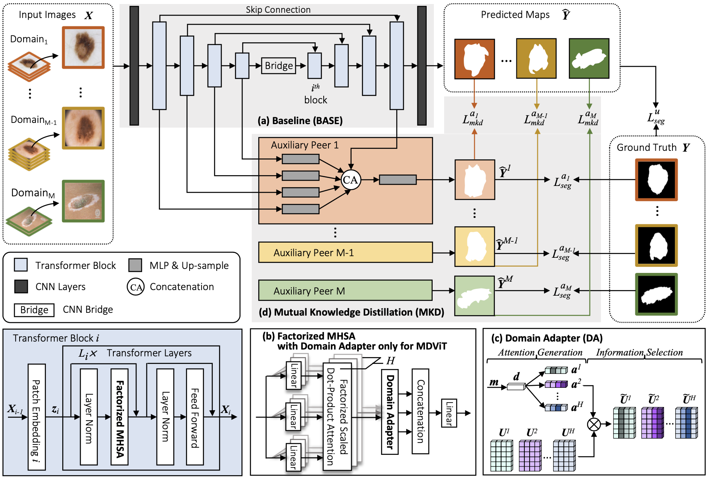

# MDViT: Multi-domain Vision Transformer for Small Medical Image Segmentation Datasets

<!--  -->

<p align="center">Overall architecture of MDViT, which is trained on multi-domain data by optimizing two types of losses: $L_{seg}$ and $L_{mkd}$. MDViT extends BASE (a) with DA inside factorized MHSA (b), which is detailed in (c), and MKD (d).</p>

This is a PyTorch implementation for [MDViT: Multi-domain Vision Transformer for Small Medical Image Segmentation Datasets, MICCAI 2023][6].

We also include plenty of comparing models in this repository: SwinUnet, UNETR, UTNet, TransFuse, DASE [8], and USE [7] (Please go to the paper to find the detailed information of these models).

If you use this code in your research, please consider citing:

```text
@inproceedings{du2023mdvit,
  title={{MDViT}: Multi-domain Vision Transformer for Small Medical Image Segmentation Datasets},
  author={Du, Siyi and Bayasi, Nourhan and Hamarneh, Ghassan and Garbi, Rafeef},
  booktitle={26th International Conference on Medical Image Computing and Computer Assisted Intervention (MICCAI 2023)},
```


## Requirements
This code is implemented using Python 3.8.1, PyTorch v1.8.0, CUDA 11.1 and CuDNN 7.
```sh
conda create -n skinlesion python=3.8
conda activate skinlesion  # activate the environment and install all dependencies
cd MDViT/
conda install pytorch==1.11.0 torchvision==0.12.0 torchaudio==0.11.0 cudatoolkit=11.3 -c pytorch
# or go to https://pytorch.org/get-started/previous-versions/ to find a right command to install pytorch
pip install -r requirements.txt
```

## Data
### Data Preparation

* [ISIC 2018 (ISIC)][1]
* [Dermofit Image Library (DMF)][2]
* [Skin Cancer Detection][3]
* [PH2][4]

### Preprocessing

1. Please run the following command to resize original images into the same dimension (512,512) and then convert and store them as .npy files.
```sh
python Datasets/process_resize.py
```

2. Use [Datasets/create_meta.ipynb][5] to create the csv files for each dataset.

## Training and Evaluating
1. MDViT
```sh
python -u multi_train_MDViT.py --exp_name test --config_yml Configs/multi_train_local.yml --model MDViT --batch_size 4 --adapt_method Sup --dataset isic2018 PH2 DMF SKD --k_fold 0
```

2. TransFuse or TransFuse+DA
```sh
# TransFuse
python -u multi_train_TransFuse.py --exp_name test --config_yml Configs/multi_train_local.yml --model TransFuse --batch_size 4 --adapt_method False --dataset isic2018 PH2 DMF SKD --k_fold 0
# TransFuse+DA
python -u multi_train_TransFuse.py --exp_name test --config_yml Configs/multi_train_local.yml --model TransFuse_adapt --batch_size 4 --adapt_method Sup --dataset isic2018 PH2 DMF SKD --k_fold 0
```

3. BASE or other models
```sh
# BASE  BASE+DSN  SwinUnet UTNet  SwinUNETR  BASE+DASE  BASE+USE
python -u multi_train_TransFuse.py --exp_name test --config_yml Configs/multi_train_local.yml --model TransFuse --batch_size 4 --adapt_method False --dataset isic2018 PH2 DMF SKD --k_fold 0
```


[1]: https://challenge.isic-archive.com/data/#2018
[2]: https://licensing.edinburgh-innovations.ed.ac.uk/product/dermofit-image-library
[3]: https://uwaterloo.ca/vision-image-processing-lab/research-demos/skin-cancer-detection
[4]: https://www.fc.up.pt/addi/ph2%20database.html
[5]: https://github.com/siyi-wind/MDViT/blob/master/Datasets/create_meta.ipynb
[6]: https://arxiv.org/abs/2307.02100
[7]: https://www.sciencedirect.com/science/article/abs/pii/S0925231219309245?casa_token=yJ-Z3vDa4xgAAAAA:6tiTdjmoDLLUX0Y24WJdwp5NThhhkKKhkz2nSCoKuY8G6cdGvjU3q-g879-y0tVrbmYn-kwM3g
[8]: http://openaccess.thecvf.com/content_CVPR_2019/html/Wang_Towards_Universal_Object_Detection_by_Domain_Attention_CVPR_2019_paper.html
